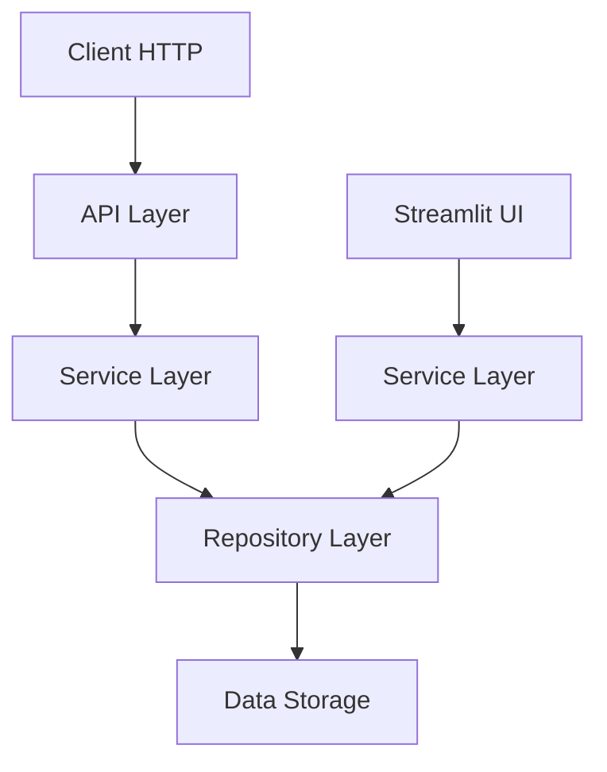

# Architecture

## Vue d'ensemble

L'application Todo List suit une architecture en couches (layered architecture) avec une séparation claire des responsabilités.

## Structure du projet

```
todo_app/
├── __init__.py
├── api.py          # Couche API (FastAPI)
├── config.py       # Configuration
├── logger.py       # Logging
├── models.py       # Modèles de données (Pydantic)
├── repository.py   # Couche d'accès aux données
├── service.py      # Couche logique métier
└── webapp.py       # Interface utilisateur (Streamlit)
```

## Couches de l'architecture

### 1. Couche API (api.py)

- **Responsabilité** : Gestion des requêtes HTTP
- **Technologie** : FastAPI
- **Fonctions** :
  - Validation des entrées
  - Gestion des erreurs HTTP
  - Sérialisation des réponses

### 2. Couche Service (service.py)

- **Responsabilité** : Logique métier
- **Fonctions** :
  - Orchestration des opérations
  - Validation métier
  - Gestion des transactions

### 3. Couche Repository (repository.py)

- **Responsabilité** : Accès aux données
- **Fonctions** :
  - CRUD operations
  - Abstraction de la source de données
  - Gestion de la persistance

### 4. Couche Modèles (models.py)

- **Responsabilité** : Définition des structures de données
- **Technologie** : Pydantic
- **Fonctions** :
  - Validation des données
  - Sérialisation/désérialisation
  - Documentation automatique

## Flux de données



## Principes architecturaux

### 1. Séparation des responsabilités

Chaque couche a une responsabilité unique et bien définie.

### 2. Inversion de dépendance

Les couches supérieures dépendent d'abstractions, pas d'implémentations concrètes.

### 3. Testabilité

L'architecture facilite les tests unitaires et d'intégration.

### 4. Évolutivité

La structure permet d'ajouter facilement de nouvelles fonctionnalités.

## Technologies utilisées

### Backend
- **FastAPI** : Framework web moderne et performant
- **Pydantic** : Validation et sérialisation des données
- **Uvicorn** : Serveur ASGI

### Frontend
- **Streamlit** : Interface utilisateur simple et interactive

### Outils de développement
- **pytest** : Framework de tests
- **Ruff** : Linter et formateur
- **Black** : Formateur de code
- **mypy** : Vérificateur de types
- **MkDocs** : Documentation

## Configuration

### Variables d'environnement

```bash
APP_NAME=Todo List API
DEBUG=false
HOST=0.0.0.0
PORT=8000
LOG_LEVEL=INFO
```

### Gestion des dépendances

Le projet utilise Hatch pour la gestion des dépendances et des environnements virtuels.

## Déploiement

### Développement local

```bash
# API
hatch run start-api

# Interface web
hatch run start-web
```

### Docker

```bash
# Développement
docker-compose up

# Production
docker build -t todo-api .
docker run -p 8000:8000 todo-api
```

## Monitoring

### Health checks

- `/health` : Vérification de l'état de l'API
- `/health/ready` : Vérification de la disponibilité

### Logs

Les logs sont structurés et incluent :
- Niveau de log
- Timestamp
- Message
- Contexte
